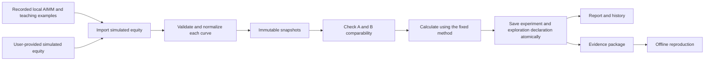
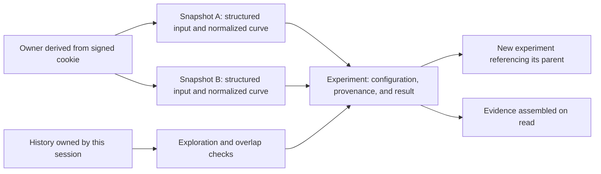

# Architecture

Cloudflare Python Workers runs the FastAPI business API, a single-page workbench through Workers Assets, and session-scoped SQLite-backed Durable Objects. The calculation engine and offline reproduction tool use only the Python standard library. The pinned Worker toolchain is under `workers/`. Local development runs the same Worker entrypoint and Durable Object classes through Wrangler. Python outside Workers is used for tests, build tools and offline evidence reproduction. See [README](../README.md) for startup.

[METHOD](METHOD.md) defines the financial semantics. [IMPLEMENTATION-CONTRACT](IMPLEMENTATION-CONTRACT.md) specifies fields, numerical limits, and endpoints. This document explains how the modules work together.

## Data flow and modules

Example endpoints return curves rather than creating snapshots. The workbench and API clients first import A and B, obtain snapshot IDs owned by the current session, then validate and create an experiment. Validation does not persist a record. Experiment creation validates the stored curves again. Changing a curve, interval, or criterion creates a new record.

| Module | Responsibility and boundary |
| --- | --- |
| `app/adapters/demos.py` | Check public fixture hashes, convert verified valuation times, and provide five examples |
| `app/domain/engine.py` | `normalize_curve`, `validate_pair`, and `evaluate`; no network, database, or FastAPI dependency |
| `app/main.py` | Request boundaries, session isolation, workflow orchestration, research declarations, health, and release proof |
| `app/storage.py` | Storage exceptions and experiment-finalization rules |
| `app/workers_storage.py` | Session-scoped SQLite Durable Objects, atomic history/quota checks, chunked payloads, and compact history summaries |
| `app/source_version.py` | Source fingerprint embedded by local and release Worker builds |
| `worker.py` | Bind Worker storage and assets to FastAPI; disable the external Nexus connection |
| `scripts/build_worker.py` | Produce an isolated Worker bundle with matching code/assets, original fixture bytes, and build identity |
| `app/evidence.py` | Assemble evidence, check hashes and normalization, and call the engine for reproduction |
| `app/reproduce.py` | Offline CLI; no source credentials or network access |
| `web/` | Present API results, history, and downloads without a second financial calculation engine |

Calculations use a local 50-digit Decimal context. Inputs allow at most 40 significant digits and nonzero adjusted exponents from -30 to 30. Equity and metrics are decimal strings. Correlation is a finite float or `null`; with one daily return, sample volatility and correlation are both `null`. Exact boundaries are specified in the implementation contract.

## Records and transactions

Snapshot and experiment content is saved with its metadata in one transaction. The Durable Object backend provides health, snapshot creation, owner-scoped reads, history listing and experiment saving through asynchronous Worker bindings.

### Cloudflare Durable Objects

The application chooses a private Durable Object from the authenticated session owner. The object validates its bound owner. A fixed dedicated object handles storage health checks. The cookie-signing secret is a stable `SESSION_SECRET` binding, not a value generated per request or stored in an ephemeral Worker filesystem.

| Table | Fields | Purpose |
| --- | --- | --- |
| `metadata` | `key` primary key, `value` | Bind the object to its owner |
| `records` | `kind`, `id`, `created_at`, `payload_hash`, `chunk_count`, `summary`, `summary_hash` | Index snapshots and experiments; preserve integrity metadata and compact history summaries |
| `chunks` | `kind`, `id`, `sequence`, `payload` | Store complete payloads as ordered UTF-8 chunks of at most 256 KiB |

Quota checks, history-overlap checks, experiment finalization, metadata, and all payload chunks use `ctx.storage.transactionSync`. UTF-8 characters are not split across chunks. History listing reads compact summaries instead of loading every full result. Reads check chunk sequence/count and content hashes before reconstructing a record. JSON text crosses the Worker binding boundary so financial numbers do not pass through JavaScript Number conversion.

### Shared invariants

Snapshots contain normalized `curve`/`content_hash`, `raw_curve`/`raw_content_hash`, and `normalization_version`. `raw_curve` is parsed structured input; decimal JSON numbers have already been preserved as strings, so it is not a byte-for-byte copy of the uploaded file. Reading a snapshot recomputes both normalized and raw-input hashes; mismatch blocks calculation and export.

References to snapshots and parent experiments are JSON ID fields checked by the application against the owner, not database foreign keys. There is no separate result table. Cross-session reads and references return 404. Each session permits at most 100 snapshots and 100 experiments.

Creation and read endpoints are append-only; changing research conditions creates a new record. Administrators retain control over underlying storage; hashes detect content inconsistency rather than establishing an administrator-proof audit log. Cookie expiry does not delete records. Cross-device account recovery and automatic retention cleanup are outside this version.

## Research declarations and evidence

Experiments default to `historical_exploration` and `data_seen=true`. A request for `declared_holdout` is downgraded when data is declared seen, a source is marked observed, a parent experiment exists, or a same-session experiment overlaps. History checks and insertion occur in the same write transaction.

`declared_holdout` records the user's declaration. `locked_at` records when the configuration was saved. History checks cover only the current session and cannot certify external research or registration before data existed. Records retain requested/effective modes, downgrade reasons, seen-data declarations, application version, source hash, optional review commit, and both snapshot identities and hashes.

Evidence is assembled from the saved experiment and snapshots. It uses the saved result's `method_version`, preserving older method labels. Current exports contain structured original inputs, normalized curves, `normalization_version`, configuration, provenance, results, and integrity hashes. SHA-256 uses sorted-key canonical JSON: one hash covers the whole package excluding `integrity`; two others cover normalized A/B curves. The payload hash also covers `raw_curves`.

Offline reproduction checks method and normalization versions, package and curve hashes, normalized inputs, and the relationship `normalize(raw_curve)==saved_curve`. It then runs the same engine and compares results. Earlier v1 packages may omit `raw_curves` or `comparison_facts`; existing paths, metrics, criteria, and states must still match. New results declare `display_language=en`. Legacy packages without that marker use the preserved Chinese presentation during reproduction, with complete result equality retained.

`source_sha256` identifies application Python files, direct web files, local dependency declarations/lockfiles, the Worker entrypoint/configuration/toolchain locks, and the Worker build script. The build computes this fingerprint from source and embeds it in the Worker bundle. Generated bundles and runtime data are excluded. Recorded fixtures have separate manifest and evidence hashes. Reproduction verifies input/result consistency; source declarations and research interpretation are governed by the [method](METHOD.md).

## Sources and access boundaries

The AIMM examples are native local simulated backtest outputs from a pinned upstream revision. The adapter checks original file hashes, converts bar-open labels to verified closing valuation boundaries, and reads initial capital from the manifest's explicit declaration. Worker bundles embed the original fixture bytes. All example intervals have been observed; duplicate, cash, missing-day, and tradeoff examples explicitly identify constructed data.

The Worker serves examples and simulated JSON imports. Its external Nexus adapter is disabled.

Browser sessions use an HttpOnly, SameSite=Strict signed cookie. The owner is a hash of a random nonce; HMAC-SHA256 authenticates it. Cookies last 30 days. Production HTTPS uses `COOKIE_SECURE=true`. This isolates browser sessions without creating verified user accounts; CLI clients use a cookie jar to retain their session.

The service checks Host and write-request Origin, rejects cross-site browser requests, and applies a same-origin CSP to the workbench. JSON request bodies are limited to 2 MiB, reject duplicate keys and non-finite numbers, and preserve decimal text before domain validation. There are no arbitrary-URL downloads, browser-supplied source credentials, order endpoints, or wallet endpoints.

## Worker configuration and release binding

| Setting | Behavior |
| --- | --- |
| `PUBLIC_ORIGIN` | Allowed HTTPS origin and Host; the local Worker defaults to `http://127.0.0.1:8787` |
| `COOKIE_SECURE` | Set to `true` for release builds and `false` for local HTTP |
| Embedded review commit | Release builds derive the commit from a clean Git checkout; local builds remain unbound |
| `SESSION_SECRET` | Encrypted Worker secret used to sign cookies; at least 32 characters, preserved across deployments |
| `SESSIONS` | Binding to session-scoped SQLite-backed Durable Objects |
| `ASSETS` | Binding for same-origin workbench assets |

`/health` checks Durable Object storage and reports the method, source hash and embedded review commit. `/.well-known/xagent-verification.json` returns release metadata when a valid commit is bound. Build records and external requests establish agreement among source, Worker bundle and deployed service. Deployment and submission procedures are in the [release guide](RELEASE.md).
